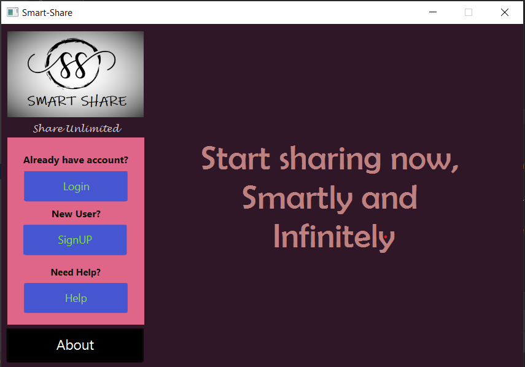
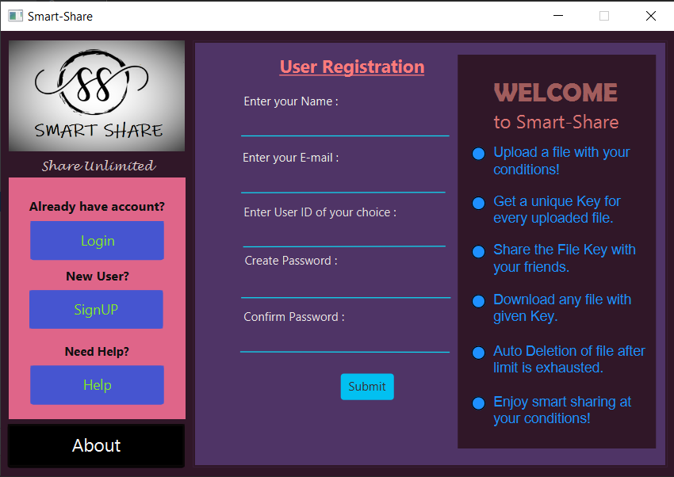
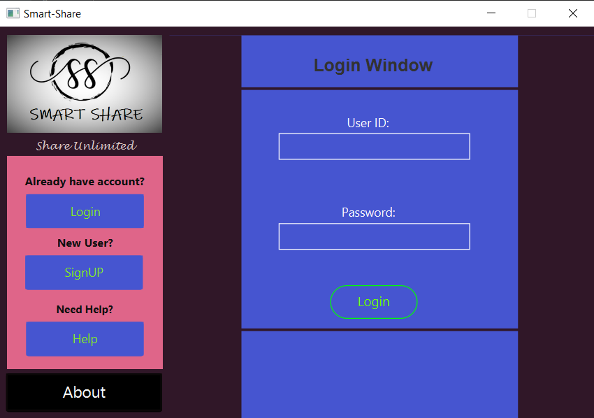
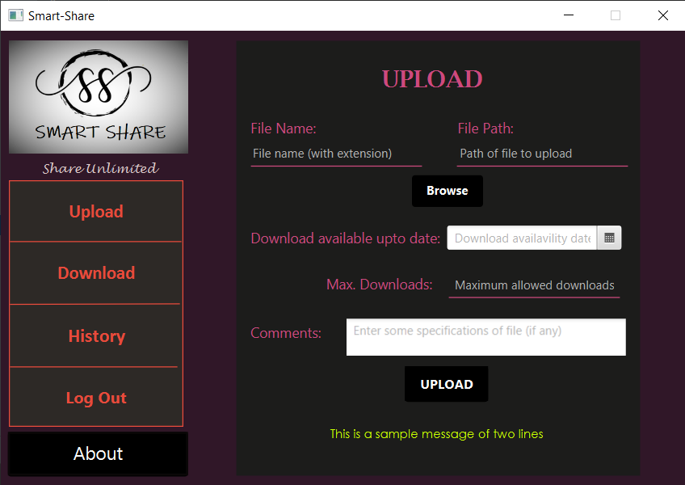
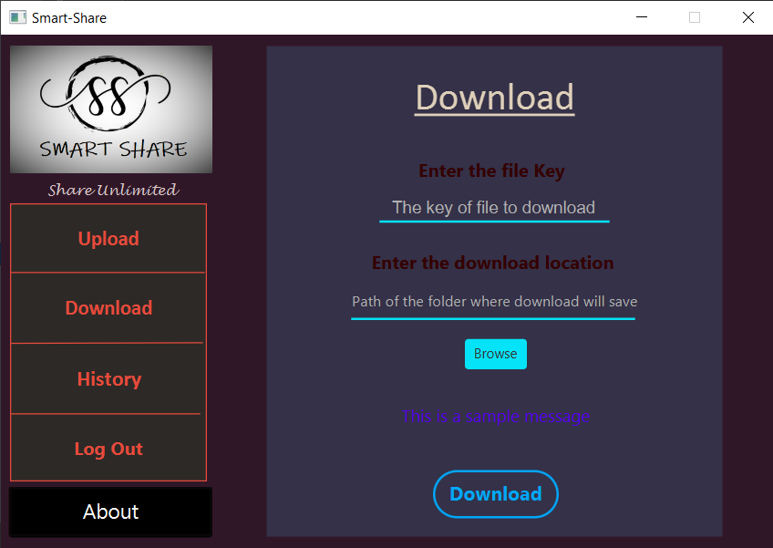
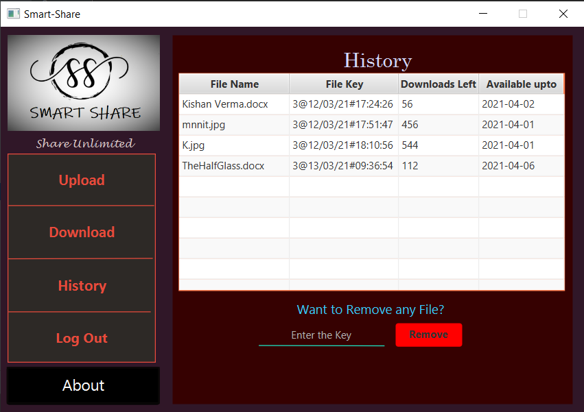

# Smart-Share
* <h3>BASIC FEATURES:</h3>	

	* A User is able to  register and login to the server.	
	
   * Every user is able to upload and download the files.

    * File uploaded is transferred to the server along with all the details like owner,name,size,type.

   * Uploader is able to tell how many times the given file can be downloaded. After that file is downloaded the mentioned number of times it is deleted from the server.

  * Every uploaded file has a code <b>(key)</b> generated which will be shared.

   *  Every user is able to download file from the server with the code given to him.

* <h3> ADVANCE FEATURES:</h3>

    * Uploader can set the time for which the file is available for download, after that time passes the file is deleted from the server.

   * Uploader can revoke a file using its identifier. If he does so then that file identifier can't be used to download a file anymore or file gets deleted from the server.

* <h3> Some Snapshots from the app:</h3>

    
    
    
    
    
    
    
    
    
    
    

